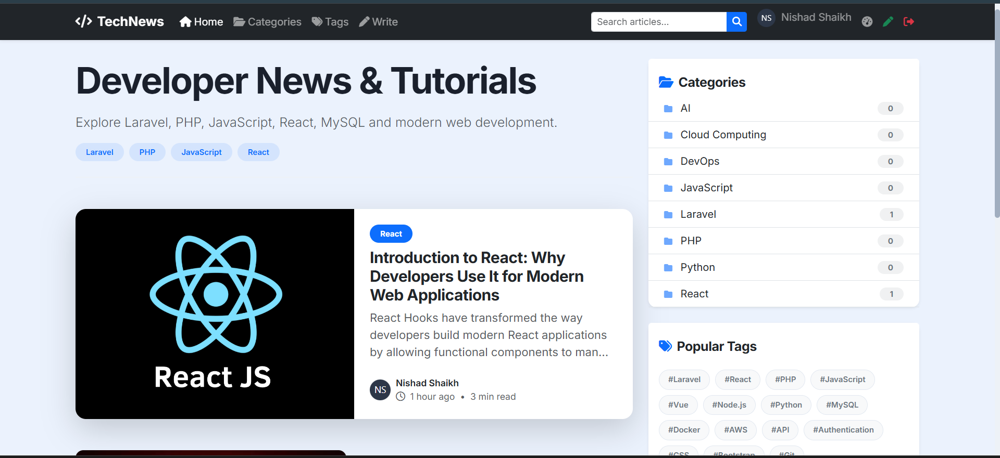
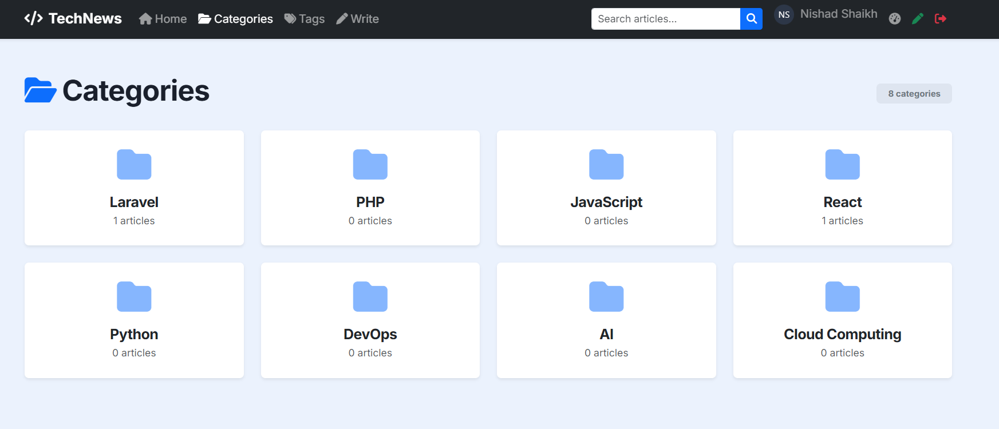
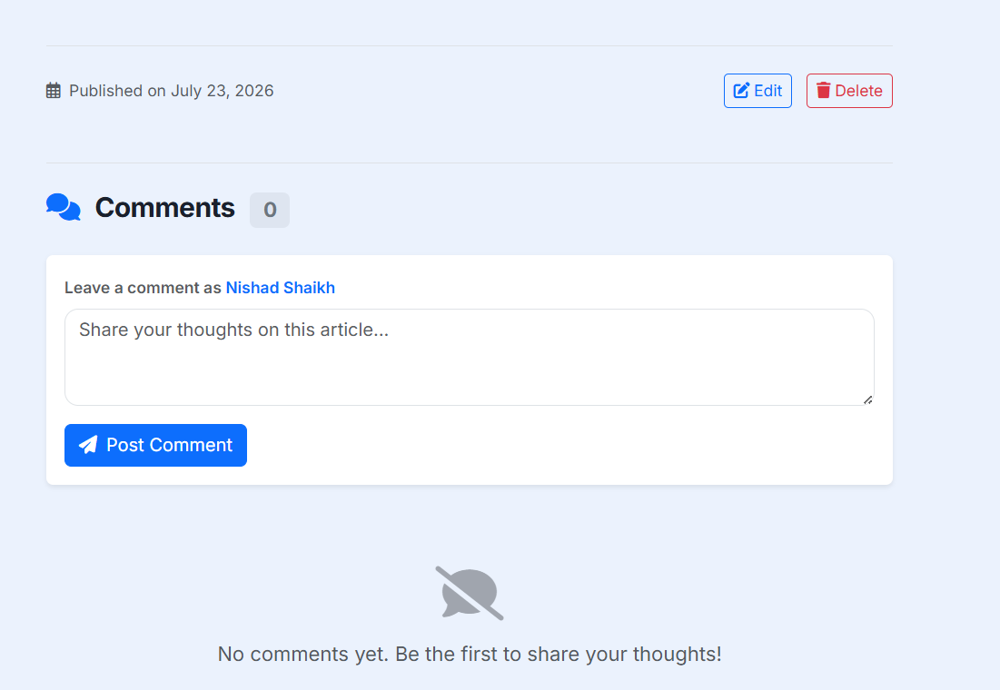
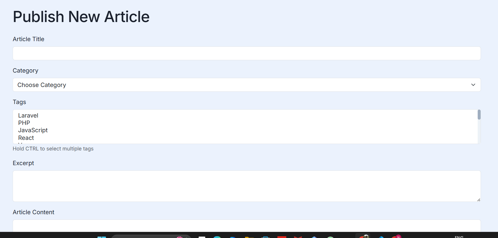

# 🚀 TechNews - Developer Blog & Tech Article Publishing Platform

<div align="center">


**A modern, feature-rich developer blog and tech article publishing platform built with Laravel 13**

[Features](#-features) • [Demo](#-demo) • [Installation](#-installation) • [API](#-api) • [Contributing](#-contributing)

</div>
🎯 Project Overview
TechNews is a modern, feature-rich developer blog and tech article publishing platform built with Laravel 13. It serves as a knowledge-sharing hub where developers, programmers, and tech enthusiasts can publish technical articles, tutorials, and insights about web development, programming languages, frameworks, and emerging technologies.

The platform bridges the gap between content creators (authors) and knowledge seekers (readers) by providing a seamless, intuitive, and engaging experience for both parties.

✨ Core Features
For Readers
Browse Articles: Explore latest tech content with pagination

Search: Find articles by keywords, categories, or tags

Categories: Filter content by technology categories

Tags: Discover related content through tagging

Comments: Engage with authors through comments

Newsletter: Subscribe for latest updates
---

## 📋 Table of Contents

- [📖 About TechNews](#-about-technews)
- [✨ Features](#-features)
- [🛠️ Technology Stack](#️-technology-stack)
- [📊 Database Schema](#-database-schema)
- [🏗️ Architecture](#️-architecture)
- [🚀 Quick Start](#-quick-start)
- [📦 Installation](#-installation)
  - [Prerequisites](#prerequisites)
  - [Step-by-Step Installation](#step-by-step-installation)
  - [Environment Configuration](#environment-configuration)
- [🔧 Usage](#-usage)
  - [User Roles](#user-roles)
  - [Article Management](#article-management)
  - [Comment System](#comment-system)
- [📧 Email Configuration](#-email-configuration)
- [☁️ Deployment](#️-deployment)
  - [AWS Deployment](#aws-deployment)
  - [Local Development](#local-development)
- [📁 Project Structure](#-project-structure)
- [🧪 Testing](#-testing)
- [🤝 Contributing](#-contributing)
- [📄 License](#-license)
- [👨‍💻 Author](#-author)

---

## 📖 About TechNews

TechNews is a comprehensive developer blog and tech article publishing platform built with Laravel 13. It empowers developers and tech enthusiasts to share their knowledge, tutorials, and insights with the global developer community.

### 🎯 Purpose

- **For Authors:** Publish technical articles using Markdown, manage content, and engage with readers
- **For Readers:** Discover high-quality tech content, interact with authors, and learn new technologies
- **For Community:** Foster a collaborative environment for knowledge sharing and technical discussions

---

### Project Image Overview 










## QUIK Start 
# Author login Creadential and dashboard view 
Name: Nishad Shaikh
Email: shaikh.nishad2005@gmail.com
password :12345678
Role: author
┌─────────────────────────────────────────────────────────────┐
│                    AUTHOR DASHBOARD                        │
├─────────────────────────────────────────────────────────────┤
│  👤 User: Nishad Shaikh                                    │
│  📧 Email: shaikh.nishad2005@gmail.com                            │
│  🎯 Role: AUTHOR                                          │
├─────────────────────────────────────────────────────────────┤
│  📊 Stats Summary                                         │
│  ├── Total Articles: 25                                   │
│  ├── Published: 20                                        │
│  ├── Drafts: 5                                            │
│  ├── Total Views: 15,000+                                 │
│  └── Total Comments: 87                                   │
├─────────────────────────────────────────────────────────────┤
│  📝 Recent Comments                                       │
│  ├── John: "Great article!" - 2 hours ago                │
│  ├── Sarah: "Very helpful!" - 1 day ago                  │
│  └── Mike: "Thanks for sharing!" - 3 days ago            │
├─────────────────────────────────────────────────────────────┤
│  📄 My Articles                                           │
│  ├── "Laravel 13..." ✅ Published - 1,200 views          │
│  ├── "React Hooks..." ✅ Published - 800 views            │
│  └── "PHP 8.3..." 📝 Draft - Not Published               │
├─────────────────────────────────────────────────────────────┤
│  🔄 Actions                                               │
│  ├── Write New Article                                    │
│  ├── Edit Profile                                         │
│  └── View All Articles                                    │
└─────────────────────────────────────────────────────────────┘

# Reader Role Login Credential and dashboard view 
Name: Nishad Shaikh
Email: nishadshaikh@gmail.com
password :12345678
Role: Reader 

┌─────────────────────────────────────────────────────────────┐
│                    READER DASHBOARD                        │
├─────────────────────────────────────────────────────────────┤
│  👤 User: John Doe                                         │
│  📧 Email: john@example.com                               │
│  🎯 Role: READER                                          │
├─────────────────────────────────────────────────────────────┤
│  📊 Activity Summary                                      │
│  ├── Total Comments: 15                                   │
│  ├── Articles Read: 120                                   │
│  └── Subscribed: Yes                                      │
├─────────────────────────────────────────────────────────────┤
│  📝 My Comments                                           │
│  ├── Comment on "Laravel 13..." - 2 days ago             │
│  ├── Comment on "React Hooks..." - 5 days ago            │
│  └── Comment on "PHP 8.3..." - 1 week ago                │
├─────────────────────────────────────────────────────────────┤
│  🔄 Actions                                               │
│  ├── Edit Profile                                         │
│  ├── Browse Articles                                      │
│  └── Become an Author                                     │
└─────────────────────────────────────────────────────────────┘


## ✨ Features

### 🎨 Frontend Features

| Feature | Description |
|---------|-------------|
| **HTML5 Semantic Layout** | Uses `article`, `section`, `aside`, `time` tags for SEO optimization |
| **Responsive Design** | Fluid typography with `clamp()` for perfect readability on all devices |
| **Developer Fonts** | Google fonts: Inter (body) & JetBrains Mono (code) |
| **Bootstrap 5 Grid** | Responsive article listing with 2-column grid layout |
| **Dark Mode Ready** | Code blocks with syntax highlighting |
| **Mobile-First** | Optimized reading experience on mobile devices |

### ⚙️ Backend Features

| Feature | Description |
|---------|-------------|
| **Authentication** | Secure login/register with role-based access (Reader/Author) |
| **Article CRUD** | Complete create, read, update, delete functionality |
| **Markdown Support** | Write articles in Markdown, rendered to HTML |
| **Categories & Tags** | Organize content with categories and tags |
| **Search** | Full-text search across articles, categories, and tags |
| **Comments** | Nested comment system with moderation |
| **Email Notifications** | Authors receive email notifications for new comments |
| **Views Tracking** | Automatic article view counter |
| **Reading Time** | Auto-calculated reading time for each article |

### 🔒 Security Features

- CSRF(Cross-Site Request Forgery) Protection ,laravel automatically provides it 
- XSS Prevention
- SQL Injection Prevention
- Role-based Authorization
- Password Hashing
- Session Management


### 📱 Mobile Responsive

| Breakpoint | Device | Layout |
|------------|--------|--------|
| < 768px | Mobile | Single column, stacked |
| 768-992px | Tablet | 2-column grid |
| > 992px | Desktop | 3-column grid + sidebar |

---

## 🛠️ Technology Stack

### Backend
```yaml
Framework: Laravel 13.20.0
Language: PHP 8.3
Database: MySQL 8.0
ORM: Eloquent
Queue: Database/SQS
Cache: Database/Redis
```
### Frontend
CSS Framework: Bootstrap 5.3
JavaScript: Vanilla JS + Alpine.js
Fonts: Google Fonts (Inter, JetBrains Mono)
Icons: Font Awesome 6
Build Tool: Vite
### Database Schema 
┌─────────────────────────────────────────────────────────────────────────────┐
│                              DATABASE SCHEMA                               │
├─────────────────────────────────────────────────────────────────────────────┤
│                                                                             │
│  ┌─────────┐          ┌──────────────┐          ┌─────────────┐           │
│  │  users  │◄─────────│   articles   │─────────►│ categories  │           │
│  ├─────────┤          ├──────────────┤          ├─────────────┤           │
│  │ id      │          │ id           │          │ id          │           │
│  │ name    │          │ user_id (FK) │          │ name        │           │
│  │ email   │          │ category_id  │          │ slug        │           │
│  │ password│          │ title        │          └─────────────┘           │
│  │ role    │          │ slug         │                                    │
│  └─────────┘          │ excerpt      │          ┌─────────────┐           │
│         ▲             │ content      │          │    tags     │           │
│         │             │ featured_img │          ├─────────────┤           │
│         │             │ status       │          │ id          │           │
│         │             │ views        │          │ name        │           │
│         │             │ reading_time │          │ slug        │           │
│         │             │ published_at │          └─────────────┘           │
│         │             └──────────────┘               ▲                    │
│         │                  │                         │                    │
│         │                  │                         │                    │
│  ┌─────────────┐   ┌──────┴──────────┐   ┌──────────┴────────────┐      │
│  │  comments   │   │  article_tag    │   │      subscribers       │      │
│  ├─────────────┤   ├─────────────────┤   ├────────────────────────┤      │
│  │ id          │   │ article_id (FK) │   │ id                     │      │
│  │ article_id  │   │ tag_id (FK)     │   │ email                  │      │
│  │ user_id     │   └─────────────────┘   │ verified               │      │
│  │ parent_id   │                         │ timestamps             │      │
│  │ comment     │                         └────────────────────────┘      │
│  │ status      │                                                         │
│  │ timestamps  │                                                         │
│  └─────────────┘                                                         │
│                                                                             │
└─────────────────────────────────────────────────────────────────────────────┘

### MVC architecture 
┌─────────────────────────────────────────────────────────────────────────────┐
│                           MVC ARCHITECTURE                                 │
├─────────────────────────────────────────────────────────────────────────────┤
│                                                                             │
│   ┌─────────────┐    ┌─────────────┐    ┌─────────────┐                   │
│   │   VIEWS     │    │  CONTROLLER │    │   MODEL     │                   │
│   │  (Blade)    │◄───│  (Logic)    │───►│ (Database)  │                   │
│   └─────────────┘    └─────────────┘    └─────────────┘                   │
│         │                  │                  │                            │
│         │                  │                  │                            │
│   ┌─────▼─────┐    ┌──────▼──────┐    ┌──────▼──────┐                    │
│   │ HTML/CSS  │    │   Routes    │    │   MySQL     │                    │
│   │ JavaScript│    │   Middleware│    │   Tables    │                    │
│   │ Bootstrap │    │   Requests  │    │   Relations │                    │
│   └───────────┘    └─────────────┘    └─────────────┘                    │
│                                                                             │
└─────────────────────────────────────────────────────────────────────────────┘

### Request Flow

1. User Request → 2. Routes → 3. Middleware → 4. Controller → 5. Model
                                                                    │
7. Response ← 6. View ←────────────────────────────────────────────┘


### Article Creation Flow 
User (Author) → Login → Click "Write" → Fill Form
    ↓
Submit Article → Validate Input → Save to Database
    ↓
Markdown → CommonMark → HTML → Display on Site
    ↓
Tag Assignment → Category Assignment → Publish
    ↓
Article visible to Readers ✅

### QUICK START 

## Minute Quick Install

PHP >= 8.3
Composer >= 2.0
Node.js >= 20.x
MySQL >= 8.0
Nginx/Apache (optional)
Git

# 1. Clone the repository
git clone https://github.com/nishu949/technews.git
cd technews

# 2. Install dependencies
composer install
npm install

# 3. Setup environment
cp .env.example .env
php artisan key:generate

# 4. Configure database in .env
# Update DB_DATABASE, DB_USERNAME, DB_PASSWORD

# 5. Run migrations
php artisan migrate

# 6. Build frontend assets
npm run build

# 7. Start the server
php artisan serve

# cp .env.example .env
php artisan key:generate

# APP_NAME=TechNews Edit env file 
APP_ENV=local
APP_DEBUG=true
APP_URL=http://localhost

DB_CONNECTION=mysql
DB_HOST=127.0.0.1
DB_PORT=3306
DB_DATABASE=technews
DB_USERNAME=root
DB_PASSWORD=your_password

MAIL_MAILER=log  # Change to smtp for production

# Database Setup 
# Create database
mysql -u root -p
CREATE DATABASE technews CHARACTER SET utf8mb4 COLLATE utf8mb4_unicode_ci;
EXIT;

# Run migrations
php artisan migrate

# my Migration order 
# Run all migrations (Recommended)
php artisan migrate

# Or run step by step:
php artisan migrate --path=database/migrations/0001_01_01_000000_create_users_table.php
php artisan migrate --path=database/migrations/0001_01_01_000001_create_cache_table.php
php artisan migrate --path=database/migrations/0001_01_01_000002_create_jobs_table.php
php artisan migrate --path=database/migrations/2026_07_17_153438_create_categories_table.php
php artisan migrate --path=database/migrations/2026_07_17_153439_create_tags_table.php
php artisan migrate --path=database/migrations/2026_07_17_153440_create_articles_table.php
php artisan migrate --path=database/migrations/2026_07_17_153441_create_comments_table.php
php artisan migrate --path=database/migrations/2026_07_17_153442_create_article_tag_table.php
php artisan migrate --path=database/migrations/2026_07_21_145042_add_role_to_users_table.php
php artisan migrate --path=database/migrations/2026_07_23_123930_add_views_and_reading_time_to_articles_table.php
php artisan migrate --path=database/migrations/2026_07_23_125139_add_parent_id_and_status_to_comments_table.php++

# Seed sample data (optional)
php artisan db:seed

# Storage link 
php artisan storage:link

## Environment Configuration

# Database Configuration

DB_CONNECTION=mysql
DB_HOST=127.0.0.1
DB_PORT=3306
DB_DATABASE=technews
DB_USERNAME=root
DB_PASSWORD=root8668

# Mail Configuration
# Development (Log)
MAIL_MAILER=log

# Production (SMTP)
MAIL_MAILER=smtp
MAIL_HOST=smtp.gmail.com
MAIL_PORT=587
MAIL_USERNAME=your-email@gmail.com
MAIL_PASSWORD=your-app-password
MAIL_ENCRYPTION=tls
MAIL_FROM_ADDRESS="hello@technews.com"
MAIL_FROM_NAME="TechNews"

# Session & Cache
SESSION_DRIVER=database
SESSION_LIFETIME=120
CACHE_STORE=database
QUEUE_CONNECTION=database


## Project Structure 

technews/
├── app/
│   ├── Http/
│   │   ├── Controllers/
│   │   │   ├── ArticleController.php
│   │   │   ├── CategoryController.php
│   │   │   ├── TagController.php
│   │   │   ├── CommentController.php
│   │   │   ├── DashboardController.php
│   │   │   ├── AuthorController.php
│   │   │   └── NewsletterController.php
│   │   └── Requests/
│   │       └── ProfileUpdateRequest.php
│   ├── Models/
│   │   ├── User.php
│   │   ├── Article.php
│   │   ├── Category.php
│   │   ├── Tag.php
│   │   ├── Comment.php
│   │   └── Subscriber.php
│   └── Mail/
│       └── NewCommentNotification.php
├── database/
│   ├── migrations/
│   │   ├── 0001_01_01_000000_create_users_table.php
│   │   ├── 2026_07_17_153438_create_categories_table.php
│   │   ├── 2026_07_17_153439_create_tags_table.php
│   │   ├── 2026_07_17_153440_create_articles_table.php
│   │   ├── 2026_07_17_153441_create_comments_table.php
│   │   ├── 2026_07_17_153442_create_article_tag_table.php
│   │   ├── 2026_07_21_145042_add_role_to_users_table.php
│   │   ├── 2026_07_23_123930_add_views_and_reading_time_to_articles_table.php
│   │   └── 2026_07_23_125139_add_parent_id_and_status_to_comments_table.php
│   └── seeders/
│       └── DatabaseSeeder.php
├── resources/
│   └── views/
│       ├── layouts/
│       │   └── app.blade.php
│       ├── components/
│       │   ├── navbar.blade.php
│       │   └── footer.blade.php
│       ├── home/
│       │   └── index.blade.php
│       ├── articles/
│       │   ├── index.blade.php
│       │   ├── show.blade.php
│       │   ├── create.blade.php
│       │   ├── edit.blade.php
│       │   └── search.blade.php
│       ├── categories/
│       │   ├── index.blade.php
│       │   └── show.blade.php
│       ├── tags/
│       │   ├── index.blade.php
│       │   └── show.blade.php
│       ├── dashboard/
│       │   ├── author.blade.php
│       │   └── reader.blade.php
│       ├── authors/
│       │   └── show.blade.php
│       └── emails/
│           └── new-comment.blade.php
├── routes/
│   └── web.php
├── public/
│   └── storage/
│       └── articles/
├── .env.example
├── composer.json
├── package.json
└── README.md